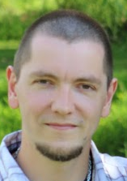

# Over ons

Deze cursus werd u aangeboden door Nico De Witte, Sille Van Landschoot en Franky Loret als onderdeel van het PWO project Machinevisie door VIVES Hogeschool Oostende / Brugge onder leiding van Martin Wylleman.

## Onze gegevens

** Nico De Witte **

* Lector / Projectmedewerker aan de hogeschool
* nico.dewitte@vives.be

** Sille Van Landschoot **

* Lector aan de hogeschool
* sille.vanlandschoot@vives.be

** Franky Loret **

* Lector aan de hogeschool
* franky.loret@vives.be

** Martin Wylleman **

* Lector en opleidingshoofd aan de hogeschool
* martin.wylleman@vives.be

