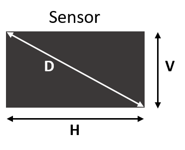

<!-- toc -->

# Camera

De camera is een essentieel onderdeel van elke machinevisie opstelling. Het legt een beeld
vast dat vervolgens door beeldverwerkingssoftware kan worden geanalyseerd en verwerkt.

Bij het selecteren van de camera zijn er een aantal eigenschappen die belangrijk zijn
voor het samenstellen van een machinevisie opstelling. Dit houdt onder andere in de:

* eigenschappen van de sensor,
* eigenschappen van de camera zelf
* en de hardware interface van de camera.

## De sensor

De sensor is het camera onderdeel waar het werkelijk beeld wordt op
geprojecteerd. Een camerasensor is hoofdzakelijk opgebouwd uit kleine lichtgevoelige
pixels die licht omzetten in spanning of stroom. Op deze manier kan een beeld worden
omgezet in een digitale representatie die verder kan worden verwerkt door beeldverwerkingssoftware.

De belangrijkste eigenschappen van een sensor zijn:

* het golflengtegebied waarvoor de sensor gevoelig is,
* de gebruikte halfgeleidertechnologie (CCD of CMOS)
* het aantal pixels,
* en de grootte van de pixels.

### Golflengte

Zichtbaar licht is elektromagnetische straling in het frequentiebereik dat waarneembaar is met het menselijk oog.
Bij licht spreekt men meestal over de golflengte in vacuüm en lucht die bij een frequentie hoort,
omdat in de meeste toepassingen met golflengten gewerkt wordt.
De golflengte is, anders dan de frequentie, afhankelijk van de stof waar de straling doorloopt.
Het zichtbare spectrum strekt zich uit over golflengten van ongeveer 380 nm (violet) tot 780 nm (rood).

![Het zichtbaar spectrum[^1]](img/visible_spectrum.jpg)

[^1]: (2012). Visible spectrum. Opgehaald van http://atomicpuke.com/?page_id=54

De drie eigenschappen die licht beschrijven, zijn de lichtsterkte (amplitude), de kleur (frequentie of golflengte) en de polarisatie (trillingsrichting).

Verschillende sensoren bestaan die ofwel gevoelig zijn voor het zichtbaar spectrum (400nm tot 700nm), het NEAR-InfraRed (NIR) spectrum (700nm tot 1000nm), het UV-spectrum (onder de 400nm) of het IR-spectrum (900nm tot 1700nm).

![Gevoeligheid van de sensor[^2]](img/sensor_sensitivity.jpg)

[^2]: Stemmer Imaging

In deze cursus zal de focus liggen op sensoren die gevoelig zijn voor licht binnen het zichtbaar spectrum.

### Halfgeleidertechnologie - CCD en CMOS

Pixels zijn kleine lichtgevoelige receptoren die het oppervlak van de sensor bezetten. In een pixel worden de fotonen die
worden opgevangen omgezet naar een spanning om zo verder te verwerken.

Er zijn hierbij twee halfgeleidertechnologieën die het meest gebruikt worden voor het opbouwen van een camerasensor, namelijk CCD (Charge Coupled Device) en CMOS (Complementary Metal Oxide Semiconductor). Elke technologie heeft zo zijn voor- en nadelen. De eerste digitale camera's maakten gebruik van CCD.

In een CCD sensor wordt elke pixel zijn lading minimaal bewerkt. De lading wordt via een uitgangsnode omgezet naar spanning, gebufferd en doorgestuurd als een analoog signaal. Dit laat toe dat de pixel maximaal wordt benut voor het opvangen van licht en minimaal wordt bezet door elektronische schakelingen. Doordat de lading ook door een enkele schakeling wordt omgezet in spanning is de uniformiteit ook zeer groot.

In een CMOS sensor heeft elke pixel zijn eigen lading-naar-spanningsconversie schakeling. Ook worden CCD sensoren via een speciaal productieproces opgebouwd, terwijl bij CMOS sensoren gebruik wordt gemaakt van traditionele transistoren. Dit zorgt er voor dat het productieproces een pak goedkoper is aangezien dit dezelfde technologie is die gebruikt wordt voor het maken van microchips. Dit laat ook toe versterkers en ruis-correctie aan elke pixel toe te voegen. Hierdoor verkleint echter wel de bruikbare oppervlakte voor het opvangen van licht (fill factor). Daarbij is de uniformiteit lager doordat elke pixel zijn eigen conversie doet wat er voor zorgt dat de kwaliteit van CMOS lager ligt. Daartegenover staat het voordeel dat de conversie parallel gebeurt en de snelheid van het opnemen van een beeld een pak hoger ligt dan bij CCD.

CMOS technologie beloofde energie-efficiënter te zijn dan CCD en net daarom heeft de technologie een grote stap voorwaarts gemaakt door de enorme investeringen door telefoonfabrikanten.

![CCD versus CMOS[^3]](img/ccd_versus_cmos.jpg)

[^3]: Meroli, S. (2012). CCD vs CMOS. Opgehaald van http://meroli.web.cern.ch/meroli/lecture_cmos_vs_ccd_pixel_sensor.html

Eigenschap              | CCD               | CMOS
------------            | -------------     | ------------
Fill Factor             | 80% – 100%        | 30% - 70%
Hoge framerate          | -/+               | ++
Ruis                    | ++                | +
Spectrale gevoeligheid  | 400 – 1100 nm     | 400 – 1100nm
Piek gevoeligheid       | 500 nm (groen)    | 650 nm (rood)
Dode pixels             | Weinig            | Veel

![Sensor fill factor[^4]](img/camera_sensor_fill_factor.jpg)

[^4]: Brawley, J. (2012). Image Sensor Architectures for Digital Cinematography. Opgehaald van https://johnbrawley.files.wordpress.com/2012/09/fill-factor.jpg

Toepassing              | CCD               | CMOS
------------            | -------------     | ------------
Meetapplicatie          | ++                | -/+
Laser                   | -/+               | ++
High Speed              | -                 | ++
Kleuren                 | ++                | -/+

#### Progressive en interlaced scan

Bij CCD zijn er twee manieren om een beeld uit de sensor te lezen. Enerzijds is er progressieve scan en anderzijds interlaced scan. Bij progressieve scan wordt de volledige sensor actief en wordt het beeld in één keer uitgelezen. Bij interlaced scan worden de ene keer de even rijen uitgelezen en de andere keer de oneven rijen. De voordelen van deze laatste techniek zijn dat de noodzakelijke dataoverdracht halveert en de gevoeligheid vergroot, anderzijds ontstaat het nadelig kameffect bij bewegende objecten, zoals te zien in onderstaande figuur.

![Kameffect bij interlaced scan[^5]](img/interlaced_versus_progressive_scan.jpg)

[^5]: ApexCCTV. Interlaced versus Progressive Scan. Opgehaald van http://www.apexcctv.com/p-1341-geovision-bx320de-3mp-ir-artic-box-ip-camera.aspx

#### Global en rolling shutter

Bij CMOS wordt er ook gesproken van global en rolling shutter. Dit heeft betrekking tot welke pixels actief zijn gedurende een bepaalde tijd. Zo zijn bij global shutter alle pixels actief, terwijl bij rolling shutter de pixels rij per rij actief worden. Deze laatste zorgt voor een parallelle vervorming bij bewegende objecten zoals te zien is in onderstaande figuur.

![Global en rolling shutter[^6]](img/global_rolling_shutter.png)

[^6]: (2013). Global shutter VS rolling shutter. Opgehaald van http://www.digitalbolex.com/global-shutter/

### Sensorafmetingen en aantal pixels

De pixels van de sensor hebben een bepaalde grootte, meestal uitgedrukt in um. Hoe groter de pixel, hoe meer licht deze kan opvangen. Om de gevoeligheid te verbeteren worden soms ook wel kleine lensjes bovenop de pixels geplaatst. Daarnaast speelt de QE (Quantum Efficiency) ook een grote rol. De QE geeft aan hoeveel lichtdeeltjes (fotonen) daadwerkelijk worden omgezet in elektronen (welke dan een lading genereren).

De afmetingen van de sensor zelf worden meestal uitgedrukt in inches. Dit is echter een erfenis van het oude formaat van televisiebuizen en stelt dus niet de exacte afmeting van de sensor voor.

Een aantal veelvoorkomende formaten van sensoren worden in onderstaande tabel weergegeven.

Sensor Formaat      | H [mm]                | V [mm]        |    D [mm]
------------        | -------------         | ------------  | ------------
1/4 inch            | 3.6                   | 2.4           | 4
1/3 inch            | 4.8                   | 3.6           | 6
1/2 inch            | 6.4                   | 4.8           | 8
2/3 inch            | 8.8                   | 6.6           | 11
1 inch              | 12.8                  | 9.6           | 16

Om de exacte afmetingen van de sensor te weten kan gebruik gemaakt worden van de resolutie en de pixelsize zoals aangegeven in volgende formules.

\begin{align}
sensor_{hor} = Rc_{hor} * pixelsize / 1000
\end{align}

\begin{align}
sensor_{ver} = Rc_{ver} * pixelsize / 1000
\end{align}

Hierbij zijn:

* \(sensor_{hor}\) de horizontale sensorgrootte [mm]
* \(sensor_{ver}\) de verticale sensorgrootte [mm]
* \(Rc_{hor}\) de horizontale resolutie van de sensor [pixels]
* \(Rc_{ver}\) de verticale resolutie van de sensor  [pixels]
* \(pixelsize\) de grootte van een pixel [um / pixel]

Merk op dat er hier wel wordt van uitgegaan dat een pixel zowel horizontaal als verticaal even groot is.

Voorbeeld:
Een sensor met een resolutie van 640 x 480 en een pixelsize van 5um heeft dus een sensorgrootte van:
\begin{align}
sensor_{hor} = 640 * 5um = 3.2mm
\end{align}
\begin{align}
sensor_{ver} = 480 * 5um = 2.4mm
\end{align}

#### Area scan en line scan camera's

De meest voorkomende sensoren zijn area scan sensoren die bestaan uit een matrix van pixels. Een area scan sensor heeft een aantal rijen \(Rc_{hor}\) van een aantal pixels \(Rc_{ver}\).

Een linescan sensor bestaat uit een zeer beperkt aantal lijnen pixels (dikwijls zelfs maar 1 rij). Om een compleet beeld te genereren moet de sensor worden verplaatst of het te inspecteren object. Dit type sensor wordt vaak gebruikt voor het controleren van plaatmateriaal (ook wel web inspection genoemd), zoals bv: papier, textiel, glas, hout, ...

![Line scan en area scan camera[^7]](img/line_area_scan.jpg)

[^7]: Teledyne DALSA (2013). Line scan illustration. Opgehaald van http://blog.teledynedalsa.com/2013/05/line-scan-cameras-for-web-inspection/

Er kan al snel worden ingezien dat een linescan sensor een complexere opstelling vereist zowel hardwarematig als softwarematig.

### Kleur of monochroom

Fotonen, met een golflengte binnen de gevoeligheid van de sensor, die invallen op de pixels van de sensor worden omgezet in een bepaalde spanning. Deze spanning wordt dan op zich gedigitaliseerd en verder verwerkt. Aangezien de pixel zelf eigenlijk geen verschil ziet tussen verschillende golflengtes (of dus verschillende kleuren) werkt elke pixel eigenlijk monochroom. Het is dan niet meer mogelijk te achterhalen wat de eigenlijke kleur was van het invallende licht.

In de meeste machinevisie applicatie is er geen nood aan kleur en volstaat een monochrome sensor. Om bijvoorbeeld te meten is er enkel een goed contrast tussen de achtergrond en het object nodig.

Wanneer er toch nood is aan kleurinformatie, dan moet voor elke pixel de waarde gekend zijn van de verschillende kleurcomponenten: Rood, Groen en Blauw (RGB). Deze informatie kan worden verkregen door gebruik te maken van 3 sensoren (meestal CCD, van daar 3-CCD) of een patroon van RGB filters (Bayerfilters genaamd) bovenop de pixels van een sensor te plaatsen.

#### 3-CCD

De oplossing met 3-CCD sensoren is echter complex en duur maar wel noodzakelijk indien men precieze kleurinformatie wil. Er wordt hier gebruik gemaakt van een aantal prisma's om het licht in zijn 3 kleurcomponenten op te splitsen en af te leiden naar verschillende sensoren. Onderstaande figuur geeft een schets terug van dit principe.

![3-CCD kleurensensor[^8]](img/3-ccd.png)

[^8]: Alper, G. (2013). 3-CCD Prism-Based Color Configuration. Opgehaald van http://info.adimec.com/blogposts/bid/98196/Bayer-Area-Scan-Color-Cameras-compared-to-3-CCD-Color-Cameras-part-1

#### Bayer-filter

In de praktijk wordt meestal gebruik gemaakt van sensoren met een Bayer-filter (genoemd naar de uitvinder Bayer) bovenop de pixels. Dit is een patroon van filters die één van de drie basiskleuren doorlaat (rood, groen of blauw). Op deze manier heeft een pixel wel informatie over de golflengte van de fotonen die er op inslaan. Er ontbreekt echter nog wel informatie over de andere kleuren.

Om de waarden van de ontbrekende informatie te verkrijgen wordt gekeken naar de buurpixels. Het gemiddelde van de omringende waarden die ontbreken voor een pixel wordt genomen en toegekend aan die pixel. Er worden zo 3 waarden verkregen waarvan één "correct" is en 2 andere een benadering. Dit proces noemt men dan ook debayering en kan door de camera worden uitgevoerd of door een PC.

![Bayer-filter voor een kleurensensor[^9]](img/1-ccd-and-bayer-color.png)

[^9]: Alper, G. (2013). Bayer Mosaic Color Filter Array Configuration. Opgehaald van http://info.adimec.com/blogposts/bid/98196/Bayer-Area-Scan-Color-Cameras-compared-to-3-CCD-Color-Cameras-part-1

Een Bayer-filter bestaat uit afwisselende rijen van rood-groen en groen-blauwe filters. Merk op dat het Bayer-filter twee keer zo zoveel groene als rode of blauwe filters bevat. Elke primaire kleur ontvangt geen gelijke fractie van het ingevallen licht. Dit om het menselijk oog te evenaren, wat gevoeliger is voor groen licht dan voor zowel rood als blauw licht.

Merk wel dat dit systeem een aantal nadelen heeft: zo zorgt debayering voor artefacten aan de rand van het beeld en bij overgangen van één kleur naar een ander. Immers: er zijn in die zone geen representatieve buurpixels om de ontbrekende waarden correct te berekenen. Daarnaast zorgt het plaatsen van filters voor een verminderde gevoeligheid (er wordt maar 1/3 van het zichtbare lichtspectrum doorgelaten).

Deze twee nadelen leiden dan ook tot de conclusie dat het geen goed idee is om een kleurensensor te gebruiken als het achteraf toch als monochroom beeld wordt verwerkt.

### De bitdiepte

De bitdiepte staat voor het aantal stappen tussen geen signaal (zwart) en maximaal signaal (wit). Dit is typisch tussen de 8 (256 stappen) en 16 bits (65.536 stappen), mede afhankelijk van de signaal-ruisverhouding van een sensor. Des te beter de signaal-ruisverhouding is, des te meer zin heeft het om een hogere bitdiepte te hebben.

## Het type camera

### Smart camera's en PC-based camera's

Een smart camera heeft zowel een camera, geheugen, CPU als I/O aan boord. Deze camera kan volledig op zich werken en heeft geen externe PC nodig om de beelden te verwerken (eventueel wel om ze te archiveren).

![Smart camera's van het merk Cognex[^10]](img/smart_camera_cognex.jpg)

[^10]: Mv Mag (2013). Cognex In-Sight 7000. Opgehaald van http://machine-vision-mag.com/smartcamera/cognex-in-sight-7000-series-vision-system/

Bij een PC-based systeem wordt een niet-intelligente machinevisie camera gebruikt die wordt gekoppeld aan een computer of embedded systeem. De beelden worden na elke captatie overgezet van de camera naar de computer om daar verder te verwerken. Dit type camera kan wel reeds een aantal preprocessing bewerkingen uitvoeren zoals (meestal aan de hand van een interne FPGA):

* **shading correctie**: belichting of lensafwijkingen kunnen er voor zorgen dat genomen beeld aan een zijde donkerder is dan aan de andere. Dit kan ook plaatsvinden van het midden van de lens naar de rand toe. Shading correctie kan dit voor een stuk corrigeren.
* **binning**: is het combineren van naast-elkaar gelegen pixels. Dit kan in een horizontale of verticale richting, of beiden. Deze techniek verlaagt de spatiale resolutie maar heeft als voordelen dat het de sensitiviteit en frame rate verhoogt (en bijgevolg de noodzakelijke bandbreedte verlaagt).
* **real-time debayering**: construeren van een kleurenbeeld uit de informatie verkregen van een camera sensor met een bayer-filter patroon.

Het grote voordeel van de smart-camera is dat je geen extra apparatuur nodig hebt om de beelden te analyseren. Daartegenover staan echter wel redelijk veel nadelen. Smart-camera's

* zijn niet zo snel als dedicated PC's;
* zijn beperkt in de beeldanalyse voor complexere machinevisie toepassingen;
* zijn meestal niet voorzien om samen te werken (met een PC-based systeem kan je verschillende camerabeelden combineren om de analyse uit te voeren);
* zijn beperkter in keuze naar hardware (sensoren, lenzen, belichting, ...) en
* hebben een grotere warmteontwikkeling

Natuurlijk hangt de juist keuze af van het type applicatie.

## De interface

In geval van een PC-based systeem dient er een dataverbinding tussen de PC en de camera te zijn. Dit om het mogelijk te maken het genomen beeld te transfereren van de camera naar de PC. Aangezien de meeste camera's niet in staat zijn meerdere beelden op te slaan moet dit zo snel mogelijk gebeuren en ook op het ritme van de framerate (snelheid waarmee de camera beelden maakt) van de camera.

Indien een smart-camera wordt gebruikt en de beelden gearchiveerd dienen te worden zal eveneens een dataverbinding aanwezig dienen te zijn om beelden off-camera op te slaan.

De combinatie van het fysische medium (de kabel en connectoren) en het transmissieprotocol wordt samengenomen onder de noemer interface. Onderstaande tabel geeft een overzicht van courant gebruikte interfaces met hun belangrijkste eigenschappen.

| 		 								|	FireWire-b	|	GigE 		|	USB 2.0	 	|	USB 3.0		|	Camera Link		| CoaXPress 	|
|-----------							|	-----------	|-----------	|	-----------	|	-----------	|	-----------		| ----------- 	|
|**Bandbreedte**						|	80 MB/s		| 100MB/s 		|	40MB/s 		|	440MB/s 	|	680MB/s 		| 100MB/s - 3.1GB/s	|
|**Kabellengte**						|	10m 		| 100m 			|	5m 			|	3m 			|	7-15m 			| 200m - 60m 		 	|
|**Voeding en data over zelfde kabel**	|	Ja			| Ja, PoE 		|	Ja 			|	Ja 			|	Ja, PoCL		| Ja		 	|
|**Acceptatie**							|	Redelijk	| Heel goed 	|	Excellent	|	Excellent	|	Laag 			| Laag       	|
|**Meerdere camera's**					|	Excellent	| Goed 			|	Redelijk 	|	Excellent	|	Redelijk		| ? 		 	|
|**Camera controle standaard**			|	IIDC		| GigE Vision	|	geen 	 	|	USB3 Vision	|	Camera Link		| CoaXPress	 	|
|**CPU gebruik**						|	Laag 		| Medium 		|	Hoog 		|	Laag 		|	Medium 			| ? 		 	|
|**Totale kost**						|	Medium 		| Laag 	 		|	Laag 		|	Laag 		|	Hoog 			| Hoog 		 	|

De bandbreedte noodzakelijk om de genomen beelden over te brengen van camera naar computer kan berekend worden aan de hand van onderstaande formule:

\begin{align}
BB = (Rc_{hor} * Rc_{ver} * f_r * PD) / (1024 * 1024)
\end{align}

Hierbij zijn:

* \(BB\) de bandbreedte in MB/s
* \(Rc_{hor}\) de horizontale resolutie van de sensor [pixels]
* \(Rc_{ver}\) de verticale resolutie van de sensor  [pixels]
* \(f_r\) de framerate (in geval van area scan) of de line frequentie (in geval van line scan)
* \(PD\) de pixel depth (aantal bytes per pixel) [bytes]

Voorbeeld:
Een Basler acA1300-200um USB 3.0 camera met volgende specs:

* \(Rc_{hor}\) = 1280 pixels
* \(Rc_{ver}\) = 1024 pixels
* \(f_r\) = 203 frames/s
* \(PD\) = 1,2 bytes (10 bits)

Resultaat:
\begin{align}
BB = (1280 * 1024 * 203 * 1,2) / (1024 * 1024) = 304,5MB/s
\end{align}

Dit valt dus inderdaad onder de maximale bandbreedte van USB3.
