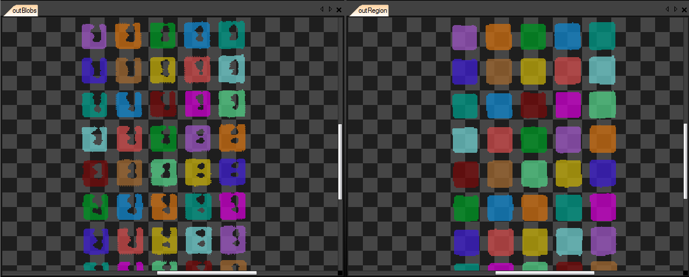

<!-- toc -->

# Beeldverwerking

[INTRO]

## De verwerkingseenheid

De eigenlijke beeldverwerking zal steeds gebeuren door software. Deze applicatie  dient echter te worden uitgevoerd op een bepaald host platform. Dit kan een smart-camera zijn, een embedded systeem, een geavanceerde PLC, een desktopcomputer, ...

Het platform en eventueel bijhorend besturingssysteem zal mede bepalen hoe de beeldverwerkingssoftware kan worden ontwikkeld.

Zo komt een smart-camera dikwijls met een ontwikkelomgeving meegeleverd om het toestel te configureren en zelfs te programmeren, bv. Cognex met In-Sight Explorer. Doch zijn er dikwijls ook SDK's (Software Development Kits) beschikbaar die toelaten de camera applicatie te schrijven in C++, C# of een andere programmeertaal.

De meeste vrijheid wordt behouden wanneer de applicatie wordt gehost op een computer. Hier kan dan worden gekozen uit tal van opties zoals grafische programmeeromgevingen, softwarebibliotheken met tal van functionaliteit in huis of hybride programmeeromgevingen die zowel een grafische context voorzien als het mogelijk maken te programmeren in tal van programmeertalen.

Wanneer de  applicatie dient uit te voeren op een embedded systeem zijn er verschillende beperkingen die in acht moeten worden genomen afhankelijk van het gekozen platform. Zo zijn vele embedded systemen beperkt in processorkracht en geheugencapaciteit. Daarnaast is het besturingssysteem soms ook een beperkende factor. Windows software draait bijvoorbeeld niet op Linux en vice versa. Daarnaast bestaan er echter ook embedded systeem die op maat gemaakt zijn voor beeldverwerking. Deze systemen hebben krachtige hardware aan boord die toelaten de beeldverwerkingsalgoritmen sneller te verwerken.

## Ontwikkelomgeving

De eigenlijke beeldverwerking zal steeds gebeuren door software. Verschillende factoren spelen een belangrijke rol bij het bepalen van de omgeving waarin beeldverwerkingssoftware zal worden ontwikkeld:

* hardware waarop de applicatie zal uitvoeren
* besturingssysteem
* camera en communicatie-interface
* programmeerervaring ontwikkelaars
* prijs
* uitbreidingsmogelijkheden
* ondersteuning
* ...

### Grafische ontwikkelomgeving

Wanneer de programmeerkennis van de ontwikkelaars beperkt is, of wanneer de applicatie snel moet worden opgebouwd kan gebruik worden gemaakt van een grafische programmeeromgeving. Deze laten toe zeer snel een applicatie of prototype te bouwen.

Vooral de beperkte noodzakelijke programmeerkennis en de snelle grafische feedback van deze ontwikkelingsomgevingen maken deze tools uiterst aantrekkelijk.

Een paar voorbeelden van zulke omgevingen zijn:

* Cognex In-Sight Explorer,
* Adaptive Vision Studio,
* NI Vision Software,
* Microscan Visionscape,
* ...

Verschillende tools in deze categorie zijn beschikbaar op de markt. Van simpele tools tot ontwikkelingsomgevingen gericht op flexibiliteit en uitbreidbaarheid.

Zo hebben sommige tools beperkte of juist zeer brede ondersteuning naar hardware toe.

Belangrijk criteria kunnen hier zijn:

* ondersteuning naar camera's en hun interfaces (GigE, USB3.0, FireWire, ...)
* mogelijkheid tot verwerken van verschillende camera streams
* ondersteuning naar multithreaded processing (gebruik maken van meerdere cores van de verwerkingseenheid)
* mogelijkheid tot aansluiten van andere sensoren (bv. lichtsluis)
* communicatiemogelijkheden met PLC's, robots of HMI's
* service en support van de firma

Daarnaast is de mogelijkheid tot het compileren van het beeldverwerkingsalgoritme tot een alleenstaande applicatie belangrijk. Kijk hierbij ook naar licentiekosten en ondersteunde besturingssystemen zoals Windows, Linux, ...

Veel tools laten de dag van vandaag ook toe eigen componenten te programmeren die dan vervolgens kunnen worden gebruikt. Zo kan de bestaande bibliotheek van algoritmen worden uitgebreid als je de kennis van de ondersteunde programmeertalen in huis hebt. Dit kan een belangrijk criteria zijn naar flexibiliteit toe.

Dit type tools zijn ook meestal terug te vinden bij smart-camera's. Sommige smart-camera's voorzien hierbij zelfs een web interface die toelaat om het apparaat te configureren, programmeren en monitoren.

### Visie programmeerbibliotheken

Visiebibliotheken zoals OpenCV, Emgu, SimpleCV, ... laten toe zelf applicaties te ontwikkelen in een programmeertaal naar keuze (als er natuurlijk een port bestaat voor die programmeertaal).

Ontwikkelen met visiebibliotheken heeft het voordeel dat je nagenoeg alles in de hand hebt en kan aanpassen naar je noden. Het is echter de steilste leercurve. Als er echter ontwikkelaars in huis zijn die de programmeertaal reeds onder de hand hebben kan hier ook vrij snel een prototype mee worden ontwikkeld.

Voordeel is hier ook dat er heel wat open source alternatieven zijn. De meeste hiervan zijn dus bruikbaar zonder licentiekosten.
Daarnaast ben je ook niet afhankelijk van het bedrijf dat de IDE ontwikkeld.

### Hybride programmeeromgevingen

Hybride programmeeromgevingen zoals MVTec HALCON laten toe om te programmeren in C, C++, C#, ... terwijl de IDE toch ook grafisch de resultaten weergeeft met allerlei features.

## Het beeldverwerkingsalgoritme

Een machinevisie applicatie bestaat typisch uit een aantal verschillende stappen. Zo moet het beeld eerst worden binnengenomen. Vervolgens moet het te inspecteren object worden gelokaliseerd waarna de eigenlijke inspectie kan plaatsvinden. Als laatste moet er dan een beslissing worden genomen en moet dit resultaat worden gecommuniceerd (visueel of hardwarematig).

De eigenlijke implementatie hiervan hangt hoofdzakelijk af van de gebruikte programmeertaal en/of programmeeromgeving. Toch zijn er aantal tools en functies die in vele visie ontwikkelomgevingen terug te vinden zijn.

Een aantal van de belangrijke inspectietools worden verder in dit hoofdstuk besproken en zullen in de bijhorende labs aan bod komen. Ter illustratie wordt er hier gebruik gemaakt van Adaptive Vision Studio 4.5.

### Begrippen

In volgende secties worden een aantal begrippen gebruikt die hier kort worden toegelicht.

Een **blob** is een groep van pixels die aan elkaar hangt. Onderstaand beeld geeft een voorbeeld van een aantal blobs.

Een **Region of Interest of ROI** is een stuk van het origineel beeld waarop we ons focussen. Door enkel dit stuk van het beeld te verwerken kan soms de verwerkingssnelheid van het algoritme worden opgedreven doordat niet het volledige beeld moet worden bewerkt of worden gefilterd. Tevens wordt dit ook toegepast om achtergrondruis (objecten waar we ons niet in interesseren) reeds vroegtijdig uit te filteren.

Onderstaand beeld geeft een voorbeeld waar de ROI werd ingesteld op een aantal gaten van een connector. Enkel deze bevinden zich dicht genoeg bij het center van de camera om ze te kunnen opmeten zonder sterke vervorming. Enkel de gaten in de ROI worden geïnspecteerd.

Een **kernel**, ook een convolutiematrix of masker genaamd, is een kleine matrix bruikbaar voor het vervagen, verscherpen, in reliëf plaatsen, randdetectie, en nog veel meer. Dit wordt gerealiseerd door middel van een convolutie tussen een kernel en een afbeelding. De kernel heeft meestal een specifieke vorm zoals een rechthoek, een ellips of een kruis.

### Filtering

Filteren laat toe om de genomen beelden te verbeteren of bepaalde fouten te corrigeren. Zo kan je het beeld filteren om ruis weg te werken, contrast te verbeteren, contouren te versterken, ...

Ruisonderdrukkingsfilters worden heel dikwijls toegepast vooraleer het beeld verder wordt verwerkt. Let wel dat dit type filters meestal de overgangen (edges) zal vervagen. Er bestaan echter ook ruisonderdrukkingsfilters die de overgang van randen wel grotendeels bewaren. Deze zijn echter over het algemeen trager.

Onderstaande figuur toont het origineel beeld van een pinconnector dat werd genomen (links) en daarna werd bewerkt met een ruisonderdrukkingsfilter (rechts).

Onderstaand een voorbeeld van een randdetectie filter.

### Thresholding

Thresholding maakt van een grijswaardebeeld een zwart-wit beeld, soms ook binarize genaamd. Hierbij wordt elke pixel die boven (of onder, afhankelijk van de configuratie van de thresholdfilter) een bepaalde waarde ligt wit of zwart gemaakt. De witte pixels stellen dan meestal de voorgrondpixels voor en kunnen dan verder worden gebruikt in het inspectieproces.

Onderstaande afbeelding geeft een voorbeeld van een connector waar thresholding wordt gebruikt om alle pins van de connector te identificeren. Verder dienen de gevonden blobs te worden opgedeeld en worden geteld om te controleren of de connector het correct aantal pins bezit.

Merk op dat in bovenstaand voorbeeld de ROI werd ingesteld op het linkse deel van de connector.

In geval de belichting kan variëren is het in de meeste gevallen best gebruik te maken van dynamische thresholding. Hierbij wordt er rekening gehouden met de intensiteitsverdeling van het volledige beeld voor het bepalen van de thresholdwaarde.

### Morfologische functies

Morfologische functies laten toe verschillende bewerkingen uit te voeren op pixel blobs. De meest voorkomende functies worden in volgende secties besproken.

#### Opsplitsing

Door pixels op te splitsen (splitting) kunnen blobs die elkaar niet raken worden opgesplitst in verschillende blobs. Dit laat toe elke blob verder op zich te verwerken.

Onderstaand een voorbeeld van een beeld dat na een thresholding werd bekomen. Ook al lijkt dit beeld voor ons te bestaan uit verschillende delen, toch is dit softwarematig maar 1 enkel object. Door de opsplitsing te maken wordt een lijst van blobs verkregen.

Bovenstaand beeld komt uit Adaptive Vision Studio. Hier wordt duidelijk aangegeven dat de afbeelding meerdere blobs bevat door deze in verschillende kleuren af te beelden. Het originele beeld wordt in 1 kleur afgebeeld.

#### Expansie

Met expansie (dilate) wordt het uitbreiden of vergroten van een blob bedoeld. Dit gebeurt op basis van een kernel met een bepaalde vorm (ellips, kruis of rechthoek) en grootte.

Deze functie kan bijvoorbeeld na een thresholding ervoor zorgen dat 1 object als 1 geheel gezien wordt indien er bepaalde delen elkaar niet volledig raken. Dit kan in sommige gevallen gebeuren omwille van inconsistente belichting, schaduwinval of een vervuiling van het object zelf.

Onderstaand beeld geeft een voorbeeld waar de expansie na een thresholding wordt gebruikt om een ROI te maken. Door de blob uit te breiden wordt het eigenlijke object volledig ingesloten en kan zo een ROI worden gecreëerd. Deze zou tevens verder kunnen worden gebruikt om het beeld te croppen of zelfs te draaien aan de hand van de oriëntatie van de ROI.

#### Eroderen

De erodeer (erode) functie laat toe de blobs te verkleinen. Dit kan handig zijn wanneer objecten kort bij elkaar liggen en na een thresholding worden gedetecteerd als 1 geheel. Door de blob te eroderen kunnen de objecten van elkaar worden gescheiden aan de randen.

Dit kan je natuurlijk niet zo doen wanneer het een meetapplicatie betreft waarbij de blobs moeten worden opgemeten. In dat geval moeten andere technieken worden toegepast.

Onderstaande beelden geven hier een voorbeeld van. Rechts werden een aantal munten via een thresholding gedetecteerd. Sommigen raken elkaar echter net aan en worden dus door de software als 1 geheel gezien. Door deze blob te eroderen en vervolgens op te splitsen kan elke munt als een aparte blob verder worden verwerkt.

#### Sluiten

Het sluiten (closing) van een blob vult de gaten in een blob op aan de hand van een bepaalde kernel (ellips, kruis of rechthoek).

Onderstaande beelden geven hiervan een voorbeeld. Rechts de verschillende blobs van een breadboard om elektronica prototypes te maken. Omwille van de reflectie van het licht worden de interne contacten niet gedetecteerd als onderdeel van de gaten. Links werd een morfologische sluiting uitgevoerd van de verschillende subblobs (na een opsplitsing te hebben gemaakt). Het resultaat is dat elk breadboard gaatje nu als een volledige blob wordt aanzien. Een volgende stap zou bijvoorbeeld het opmeten van de centerafstanden kunnen zijn.

Deze functie is gelijkaardig aan een morfologische expansie. Het verschil is echter dat de sluting hier naar binnen en niet naar buiten toe gebeurt zoals bij expansie.

#### Opvullen van gaten

Het opvullen van gaten in blobs is een veelgebruikte functie. Op basis van een kernel (ellips, kruis of rechthoek) worden gaten in een blob dicht gemaakt. Deze functie is gelijkaardig aan het sluiten van een blob maar verschilt in het feit dat het gat in de blob moet ingesloten zijn.

Dit betekent dat onderstaande blobs niet zullen worden opgevuld met deze functie:

### Blob analyse

Blob analyse wordt over het algemeen uitgevoerd nadat een thresholding werd toegepast op het origineel beeld. Door de gevonden blobs te analyseren (grootte, lengte, vorm, aantal gaten, ...) kunnen karakteristieken van het object in worden gecontroleerd.

Blobanalyse kan daarnaast ook worden gebruikt om tussen verschillende objecten te differentiëren.

Onderstaand voorbeeld is een patroon dat op robots werd geprint om deze zo te kunnen identificeren en daarnaast ook hun richting te bepalen. De grote centerdot bepaald het midden van de robot, de langwerpige dot bepaald de kijkrichting en de kleinere dots bepalen het ID van de robot.

Door naar de oppervlakte van de blobs en hun vorm te kijken kunnen de verschillende dots uit elkaar worden gehaald om zo de nodige gegevens te bepalen. Zo kan hier worden uit opgemaakt dat de robot een ID heeft van 5 en deze onder een hoek van 82 graden staat. Daarnaast kan ook de positie worden bepaald aan de hand van het centerpunt van de middendot.

Het grote voordeel van dit type analyse is dat dit simpele en dus snelle operaties zijn. In tegenstelling tot patroonherkenning dat een stuk trager is en sterk afhankelijk is van de complexiteit van de patronen.

### Meten

Meten is een van de meest gebruikte applicatievormen in de machinevisie sector. Machinevisie laat toe om dezelfde metingen uit te voeren als met de hand kunnen worden gedaan. De nauwkeurigheid hangt echter wel sterk af van de gebruikte hardware en de kwaliteit van het beeld.

Het kalibreren van de opstelling is hier echt wel noodzakelijk. Enerzijds om afwijkingen van de lens te minimaliseren en anderzijds om de omzetting te doen naar bruikbare afmetingen (anders zijn de afmetingen in pixels).

Onderstaand beeld het resultaat van een opstelling voor het opmeten van de binnen en buitendiameter van rondellen. Merk op dat de nauwkeurigheid hier vrij laag ligt doordat er geen gebruik werd gemaakt van een kalibratiepatroon  maar van een zichtbare schuifmaat voor het bepalen van de referentieschaal.

<!-- [TODO] Kunnen we hier geen voorbeeld geven van de cognex opstelling ? -->

### 2D kalibratie

Het is niet altijd noodzakelijk om een visieopstelling te kalibreren. Wanneer er echter metingen moeten plaatsvinden of er nood is aan exacte afstanden of coördinaten, dan is kalibratie een essentiële stap.

Een goede kalibratie zal enerzijds een omzetting toelaten van pixels naar mm maar zal anderzijds ook bepaalde aberraties van de lens tegengaan.

Er zijn verschillende kalibratiepatronen die kunnen worden gebruikt zoals dot-patronen of schaakbordpatronen, zoals hieronder van elk een voorbeeld te vinden is.

Voor een accurate meting kan best gebruik worden gemaakt van een professioneel geprinte kalibratieplaat.

Onderstaand beeld toont het verschil tussen het originele kalibratiepatroon en de daarna bewerkte versie met de kalibratie toegepast. Er kan duidelijk worden waargenomen dat de kussenvorming ten gevolge van de lens grotendeels wordt tenietgedaan.

### Patroonherkenning

Patroonherkenning is eigenlijk een onderwerp op zich voor een cursus. De simpelste patroonherkenningsalgoritmen zijn gebaseerd op randdetectie of op correlaties tussen pixelwaarden.

Patroonherkenning kan enerzijds gebruikt worden om de locatie van een object te bepalen. In onderstaand voorbeeld wordt de afbeelding van de "raspberry" gebruikt om de locatie en hoek te bepalen waaronder de PCB van de Raspberry Pi zich bevind.

Anderzijds wordt patroonherkenning ook veel gebruikt voor het classificeren van objecten.

Onderstaand een voorbeeld voor het classificeren van rondellen op basis van patroonherkenning.

Andere methoden voor patroonherkenning zijn:

* Op basis van beslissingsbomen
* Support Vector Machines (SVMs)
* Tikhonov Regularisation
* ...

Hier wordt echter niet verder op ingegaan.

### Optische karakter herkenning

Optische karakter herkenningsalgoritmen (Optical Character Recognition of OCR) hebben veel gemeen met patroonherkenningsalgoritmen. Echter wordt bij OCR een blob geclassificeerd als een letter van het alfabet of als een bepaald karakter.

Deze algoritmen moeten meestal worden getraind met samples van de karakters. In vele gevallen worden van deze karakters dan licht bewerkt versies bijgehouden (scheef getrokken, breder gemaakt, kleiner gemaakt, licht gedraaid,  ...) om het algoritme robuuster te maken en de kans op correcte detectie te verhogen in geval de karakters licht afwijken van de originele patronen.

Volgend voorbeeld geeft een controle tussen de gedetecteerde barcode en het getal onder de barcode. In geval van een afwijking kan het blik worden verwijderd.

Opgelet met proportionele fonts, deze kunnen soms voor problemen zorgen als de bounding boxes van de karakters gaan overlappen. Dit hangt echter af van de ondersteuning van het gebruikte algoritme. Dit probleem doet zich niet voor met monospaced fonts.

### Barcodes en QR-codes

Barcodes en data matrix codes (zoals QR-codes) worden vaak geplaatst op producten ter identificatie. Zij spelen een belangrijke rol in het track-and-trace proces van de producten binnen het assemblageproces.

Hoewel specifieke scanners bestaan om deze codes te decoderen, kan een visieapplicatie een veelzijdige en robuuste oplossing leveren.

Onderstaand voorbeeld toont hoe een QR code meer informatie kan verschaffen over een product.

Merk wel op dat een goed algoritme niet enkel perfect geprinte codes kan lezen maar ook codes moet kunnen decoderen die scheef staan of waar stukken van ontbreken.

De dag van vandaag worden ook heel veel barcodes en matrix-codes rechtstreeks op het product geprint. Dit is dikwijls efficiënter en makkelijker.
