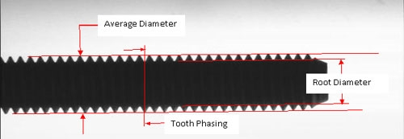
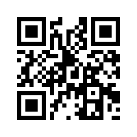
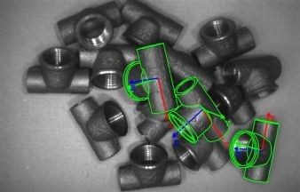

# Introductie

Vandaag de dag zijn heel wat stappen binnen het productieproces geautomatiseerd. Dit gaat van aanvoering en materiaalbewerking tot assemblage. Een logische volgende stap is het automatiseren van de kwaliteitsbewaking. Dit kan worden verwezenlijkt aan de hand van machinevisie \(machine vision\). Deze automatisatie stap heeft een tijdje op zich laten wachten door het ontbreken van de noodzakelijke technologieën waaronder beeldsensoren en verwerkingseenheden.

De dag van vandaag is dit echter geen excuus meer.

## Wat is machinevisie

Wanneer er wordt gesproken over een visiesysteem \(image processing system\), dan wordt hiermee het omzetten van beelden naar informatie bedoeld. Deze informatie kan dan verder worden gebruikt om een proces te sturen of een analyse te maken van de huidige situatie.

Een visiesysteem is een term die alle noodzakelijke componenten omvat om beelden te maken en te verwerken. Visiesystemen worden reeds jaren toegepast in de context van beveiliging, ontspanning, ... Denk hierbij aan infotainment \(samentrekking van Information en Entertainment\), informatiesystemen ten dienste van interactieve reclame, informatiekiosken in attractieparken, ...

Wanneer wordt gesproken over machinevisie, dan houdt dit een visiesysteem in binnen een industriële context.

Enerzijds wordt machinevisie toegepast als kwaliteitscontroleorgaan binnen het productieproces. Terwijl inspectie in het verleden hoofdzakelijk door de mens gebeurde kan een machinevisiesysteem dit de dag van vandaag sneller, consistenter en objectiever. Een visiesysteem werkt op het ritme van de productie en is onvermoeibaar.

Anderzijds vindt machinevisie zijn plaats binnen de materiaalhantering \(material handling\). Hierbij gaat het om geautomatiseerd opnemen en afleggen van onderdelen, waarbij het visiesysteem instaat voor het leveren van de locatie en oriëntatie van de stukken.

Machinevisie laat dus toe het productieproces verder te automatiseren en te optimaliseren.

## Waarom machinevisie gebruiken

Machinevisie kan het aantal defecten verlagen. Dit betekent ook dat minder defecte onderdelen de fabriek verlaten naar de klant met als gevolg meer tevreden klanten. Ook het aantal producten dat achteraf terug wordt geroepen kan hierdoor dalen.

Door defecte onderdelen vroeger te detecteren kunnen deze ook sneller uit het productieproces worden gehaald. Dit heeft als direct gevolg dat er minder verlies is en het productieproces optimaler zal werken. Daarbij kan de downtime van een productielijn, bijvoorbeeld veroorzaakt door miss-feeds van slechte onderdelen, ook worden verminderd.

Door onderdelen en producten te voorzien van een identificatie en deze te volgen door het proces \(track and trace\) kunnen eventuele fouten achteraf makkelijker worden terug geleid naar hun oorzaak. In sommige sectoren is het ook noodzakelijk dat elke component kan worden getraceerd door het volledige productieproces. Denk hierbij aan de auto- en vliegtuigindustrie, de voedselindustrie, ...

Door producten te voorzien van een barcode, QR-code of een andere vorm van indicatie kan ook de levertijd worden ingekort. Producten kunnen makkelijker worden geïdentificeerd en gesorteerd. Door het scannen van de code is direct allerhande informatie beschikbaar.

De kwaliteit van producten die moeten voldoen aan bepaalde strikte wetgevingen \(bv. voedsel\) kan strikter worden bewaakt.

Ten opzicht van inspectie door een persoon, heeft machinevisie het voordeel dat het sneller, consistenter en onvermoeibaar is. Zo zijn er reeds machinevisie inspectiesystemen die meer dan 1000 objecten per minuut inspecteren. Daarnaast zal de software nooit de regels buigen naar zijn eigen wil. Elk beeld zal hetzelfde worden verwerkt. Machines zijn ook perfect voor het uitvoeren van repetitieve taken, terwijl mensen beter kunnen worden ingezet voor andere taken.

## Toepassingen van machinevisie

De meeste machinevisie applicaties kunnen worden ondergebracht onder één van de noemers: inspectie, foutdetectie, meetapplicatie, identificatie of locatiebepaling.

### Inspectie

Bij inspectie wordt gecontroleerd of een product, de assemblage ervan of de verpakking werd geproduceerd zoals verwacht. Dit gebeurt over het algemeen online. Het kan hier gaan van een simpele controle of een component aanwezig is \(presence check\) tot het nagaan van vormen en samenstellingen.

Bij een online check is de machinevisie applicatie geïntegreerd in het productieproces. Dit in tegenstelling tot een offline controle waar het product uit het productieproces wordt gehaald voor een controle \(bv. steekproefsgewijs\). Een online systeem is vaak moeilijker te implementeren omdat het een directe impact heeft op de lijn tijdens de installatie ervan. Daarentegen heeft het wel het voordeel dat elk product wordt gecontroleerd en de kans dus groter is dat foute stukken worden geïdentificeerd.

Een aantal voorbeelden die binnen de categorie inspectie vallen zijn:

* controle van voedingsblikken op correcte inhoud
* nagaan of kabels correct werden geplaatst en vastgezet tijdens de assemblage van auto's
* tellen van het aantal flessen dat in een krat werden geplaatst
* controle van de kwaliteit van een label dat op een verpakking werd geprint
* ...

### Foutdetectie

Bij foutdetectie applicaties wordt hoofdzakelijk gekeken naar abnormale afwijkingen zoals krassen, scheuren, vervuilingen, verkleuring of verbrand materiaal. Deze afwijkingen kunnen bijvoorbeeld optreden ten gevolge van het productieproces.

De plaats van deze defecten zijn willekeurig. Vandaar dat de visie applicatie meestal het volledige oppervlak moet inspecteren. Er wordt hierbij gekeken naar bv. textuur en kleur. In bepaalde gevallen is het mogelijk een vergelijking te maken met een template.

Een aantal voorbeelden die binnen deze categorie vallen zijn:

* controle op scheuren in geplakte labels
* controle van tegels of laminaat op krassen of scheuren
* controle van de draad van bouten op afwijkingen
* nazicht of metalen platen geen deuken bevatten
* ...

Dit type defecten zijn dikwijls ook heel moeilijk zichtbaar met het blote oog.

### Meetapplicatie

Nagaan of het geproduceerd product binnen de tolerantiegrenzen valt is een veel gebruikte toepassing van machinevisie. De resolutie, de belichting en de kwaliteit van het beeld bepalen hier hoofdzakelijk de nauwkeurigheid van de meting. Als één van deze onderdelen ondermaats functioneert zal de kwaliteit van de meting snel achteruit gaan. Het is heel belangrijk dat een meting accuraat en reproduceerbaar is.


**Subpixel interpolatie**

Sommige softwarepakketten zoals Halcon voorzien bijvoorbeeld subpixel nauwkeurigheid \(softwarematige interpolatie tussen de echte pixels om bv. de overgang van licht naar donker exacter te bepalen of om een exactere positiebepaling te doen voor een meting\).


Een aantal voorbeelden die binnen deze categorie vallen zijn:

* controle van de grootte en positie van geponste gaten in lange metalen profielen
* opmeten van de draaddiameter van bouten
* ...

### Identificatie

Identificatie wordt hoofdzakelijk verwezenlijkt door een barcode, QR-code of een karaktercode die op het object wordt geprint of geplakt. Tijdens het productieproces kan het object zo worden gevolgd \(track-and-trace\). Het laat onder andere toe om de assemblage van alle componenten te controleren op juistheid.

Dit systeem kan bijvoorbeeld ook gebruikt worden bij pick-and-place robots om de juist componenten te selecteren die moeten worden opgenomen.

### Locatiebepaling

Machinevisie kan tevens gebruikt worden om de locatie en rotatie van objecten te bepalen die bijvoorbeeld los op een transportband liggen. Deze coördinaten kunnen dan bijvoorbeeld aan een pick-and-place robot worden doorgegeven zodat de stukken correct kunnen worden gegrepen en verplaatst.

## Een typische machinevisie opstelling

Een machinevisiesysteem, zoals weergegeven in volgende figuur, bestaat typisch uit een aantal vaste componenten zoals:

* **een camera** voor het nemen van de beelden;
* **een lens** die het weerkaatste licht van de scene op de camerasensor projecteert;
* **de belichting** die er voor zorgt dat het contrast tussen de achtergrond en voorgrond maximaal is;
* **een verwerkingseenheid** die de beelden analyseert en verwerkt. Dit kan een computer, een embedded systeem of de camera zelf zijn \(smart-camera\);
* en **een display** of **HMI** \(Human Machine Interface\) dat instaat voor de interactie met de operator.

Afhankelijk van de applicatie zijn er ook nog andere componenten noodzakelijk. In geval van een kwaliteitscontrole zal er eveneens een selectieorgaan moeten worden voorzien. Wanneer het visiesysteem concludeert dat een bepaald stuk niet aan de vooropgestelde eisen voldoet kan het op deze manier uit de productie worden gefilterd.

Als het visiesysteem dienst doet als locatie en positiebepaler van stukken die moeten worden opgenomen en verplaatst of gemonteerd, dan is er ook nood aan een pick-and-place installatie.

## Het inspectieproces

Een machinevisie applicatie bestaat typisch uit een aantal verschillende stappen. Zo moet het beeld eerst worden binnengenomen. Vervolgens moet het te inspecteren object worden gelokaliseerd waarna de eigenlijke inspectie kan plaatsvinden. Als laatste moet er dan een beslissing worden genomen en moet dit resultaat worden gecommuniceerd \(visueel of hardwarematig\).

### Beeldopname

Het doel is een zo'n goed mogelijk beeld te nemen van het object dat moet worden geïnspecteerd. Bepaalde neveneffecten zoals omgevingslicht kunnen het systeem onstabiel maken, wat natuurlijk ten allen koste moet vermeden worden.

Tijdens de beeldopname kunnen bepaalde configuratieparameters worden ingesteld zoals de wijze van belichting \(continue, flitsend, ...\), de tijd tussen het nemen van beelden, de tijd dat de sensor wordt belicht, ...

### Lokalisatie en/of identificatie

In bepaalde toepassingen ligt het te inspecteren object op een vaste plaats. In dat geval is de lokalisatie vrij simpel.

Daartegenover zijn er situaties waar het object gewoon los op een lopende band ligt. Zowel de positie als de oriëntatie is hier willekeurig. In dat geval is het noodzakelijk het object te lokaliseren, te transleren en roteren naar een gekende positie \(softwarematig weliswaar\). Pas dan kan de inspectie worden uitgevoerd. Meestal wordt hiervoor op zoek gegaan naar een bepaald patroon van het object of naar de randen ervan.

In dat geval is het meestal ook noodzakelijk over te gaan op een systeem dat getriggerd wordt wanneer het object onder de camera ligt. Dit kan worden verwezenlijkt met externe sensoren.

Als de band stil wordt gehouden tijdens het nemen van de foto moet er geen rekening worden gehouden met de belichtingstijd van de sensor, maar in het andere geval \(meestal zo\) moet de belichtingstijd worden beperkt in functie van de snelheid van de band. Hierover later meer.

### Inspectie

Dit is de stap waar het allemaal om draait. Hier gebeurt de controle van het gevonden object. Afhankelijk van de complexiteit van het algoritme kan dit snel gebeuren of redelijk wat tijd vragen.

### Besluitvorming

De bevindingen die werden gemaakt in vorige stap moeten leiden tot een bepaald besluit. Zo kan er bv. worden besloten dat het werkstuk niet aan de eisen voldoet en moet worden verwijderd uit de lijn \(aan de hand van verwerpingsmechanisme\).

In geval van een selectieprocedure op basis van de eigenschappen van het object kan het ook moeten worden afgeleid naar een ander deel van de lijn. Een voorbeeld hiervan is het sorteren van aardappelen. Deze worden ook dikwijls op basis van grootte en vorm gesorteerd.

### Communicatie / Visualisatie

In veel gevallen is er een grafische interface aanwezig die kan worden geraadpleegd door de operator van de lijn.

Meestal worden de genomen beelden samen met de bevindingen ook gearchiveerd op een server. Dit naar traceerbaarheid toe. Later kunnen de resultaten van een bepaalde periode ook statistisch worden geanalyseerd om zo het productieproces nog verder te verbeteren.

Als er een selectiemachine of verwerpingsmechanisme aanwezig is moet dit ook worden aangestuurd. Dit kan via een PLC of embedded systeem gebeuren dat in verbinding staat met de machinevisie applicatie.

