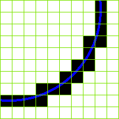

# Lens

De lens bevindt zich tussen het object waarvan we een beeld willen nemen en de sensor in de camera. Het zorgt ervoor dat het werkelijk beeld op de sensor wordt geprojecteerd. In de meeste machinevisie applicaties is het werkelijk object groter dan de projectie ervan. Er wordt dan gesproken over een magnification &lt; 1. In het andere geval wordt er gesproken van microscopielenzen, waar de magnification &gt; 1 is.

Volgende figuur schets de projectie van een werkelijk beeld op de camera sensor door de lens. In dit hoofdstuk worden alle noodzakelijke parameters voor het bepalen van de lens toegelicht.

## Field of View

Het field of view \(FOV\) is het beeldveld van de camera. Het is een virtuele oppervlakte in de werkelijk wereld met een horizontale grootte $$FOV_{hor}$$ in `mm`, een breedte $$FOV_{ver}$$ in `mm` en een afstand $$WD$$ in `mm` \(working distance\) van de lens tot het te inspecteren object.

De afmetingen van het FOV worden bepaald door:

* de maximale afmetingen van het te bekijken object;
* de variatie in positie van het object \(zowel translatie als rotatie\);
* de benodigde marge van het zoekgebied van de software;
* de aspect ratio \(breedte / hoogte verhouding\) van de camera sensor.

Onderstaand een grafisch voorbeeld van de afmetingen die het field of view bepalen.

## Spatiale resolutie

Het vereiste aantal pixels dat een sensor moet bezitten \($$Rc_{hor}$$ in `pixels` en $$Rc_{ver}$$ in `pixels`\) wordt mede bepaald door het detail dat waarneembaar moet zijn, de karakters die leesbaar moeten zijn of de meetnauwkeurigheid die moet behaald worden. Daarnaast bepaalt natuurlijk ook het field of view voor een groot stuk de nodige resolutie.

In eerste instantie moet bepaald worden hoeveel pixels noodzakelijk zijn om een bepaald detail waar te nemen, dit wordt de spatiale resolutie genoemd $$p_{detail}$$. Dit wordt voor een groot deel bepaald door de software. Sommige softwarepakketten zoals Halcon voorzien bijvoorbeeld sub-pixel nauwkeurigheid \(softwarematige interpolatie tussen de echte pixels om bv. de overgang van licht naar donker exacter te bepalen\). Dit verlaagt dan natuurlijk weer de noodzakelijke resolutie.

Volgend een overzicht van een aantal vuistregels die courant worden gehanteerd om het aantal pixels te bepalen noodzakelijk voor het detecteren van een detail.

### Optical character recognition

Bij Optical Character Recognition \(OCR\) moet ook zeker rekening worden gehouden met de kwaliteit van de karakters.

### Blobanalyse

Bij blobanalyse speelt het kleinste detail dat waarneembaar moet zijn de belangrijkste rol.

### Meetapplicatie

Bij een meetapplicatie is er nood aan 10 pixels per meetnauwkeurigheid. Indien subpixel nauwkeurigheid wordt gehanteerd mag de meetnauwkeurigheid worden gedeeld door het aantal pixels gebruikt door het subpixelalgoritme.

In het geval van een meetapplicatie kan het aantal pixels per detail worden bepaald aan de hand van volgende formule:

$$
p_{detail\_hor} = PPD_{hor} / accuracy_{hor}
$$

$$
p_{detail\_ver} = PPD_{ver} / accuracy_{ver}
$$

Hierbij zijn:

* $$p_{detail\_hor}$$ en $$p_{detail\_ver}$$ de spatiale resolutie of het aantal pixels per detail, uitgedrukt in `pixels/mm`
* $$PPD_{hor}$$ en $$PPD_{ver}$$ het aantal pixels per meetnauwkeurigheid, uitgedrukt in `pixels`
* $$accuracy_{hor}$$ en $$accuracy_{ver}$$ de kleinste afstand die meetbaar moet zijn, uitgedrukt in `mm`

Voorbeeld:

Wil men een afstand meten tot op `2mm` nauwkeurig, rekening houdend met een meetnauwkeurigheid van `10 pixels` \(dus geen subpixel nauwkeurigheid\), dan is het aantal noodzakelijke pixels per detail:

$$
p_{detail\_hor} = PPD_{hor} / accuracy_{hor} = 10 pixels / 2mm = 5 pixels/mm
$$

$$
p_{detail\_ver} = PPD_{ver} / accuracy_{ver} = 10 pixels / 2mm = 5 pixels/mm
$$

### Noodzakelijke resolutie

Bovenstaande vuistregels resulteren in een aantal noodzakelijke `pixels per mm` \($$p_{detail\_hor}$$ en $$p_{detail\_ver}$$\). Daarnaast is ook de grootte van het field of view gekend \($$FOV_{hor}$$ en $$FOV_{ver}$$, beiden uitgedrukt in `mm`\). Uit beide gegevens kan dan het benodigd aantal pixels worden berekend via onderstaande formule:

$$
Rc_{hor} = p_{detail\_hor} * FOV_{hor}
$$

$$
Rc_{ver} = p_{detail\_ver} * FOV_{ver}
$$

Hierbij zijn:

* $$Rc_{hor}$$ en $$Rc_{ver}$$ de gezochte sensor resoluties, uitgedrukt in `pixels`
* $$p_{detail\_hor}$$ en $$p_{detail\_ver}$$ de spatiale resolutie of het aantal pixels per detail, uitgedrukt in `pixels/mm`
* $$FOV_{hor}$$ en $$FOV_{ver}$$ zijn de afmetingen van het field of view, uitgedrukt in `mm`

De totaalformule kan voor een meetapplicatie ook worden uitgeschreven als:

$$
Rc_{hor} = (PPD_{hor} * FOV_{hor}) / accuracy_{hor}
$$

$$
Rc_{ver} = (PPD_{ver} * FOV_{ver}) / accuracy_{ver}
$$

Hierbij zijn:

* $$Rc_{hor}$$ en $$Rc_{ver}$$ de gezochte sensor resoluties, uitgedrukt in `pixels`
* $$PPD_{hor}$$ en $$PPD_{ver}$$ het aantal noodzakelijke pixels per detail, uitgedrukt in `pixels`
* $$FOV_{hor}$$ en $$FOV_{ver}$$ zijn de afmetingen van het field of view, uitgedrukt in `mm`
* $$accuracy_{hor}$$ en $$accuracy_{ver}$$ de kleinste afstand die meetbaar moet zijn, uitgedrukt in `mm`

Voorbeeld:

Een field of view van `50mm` \(horizontaal\) op `20mm` \(verticaal\). Daarbij willen we een afstand meten op `2mm` nauwkeurig.

Hierbij zijn:

* $$PPD_{hor}$$ = $$PPD_{ver} = 10 pixels$$ als we uitgaan dat er geen subpixel nauwkeurigheid is
* $$FOV_{hor} = 50mm$$
* $$FOV_{ver} = 20mm$$
* $$accuracy_{hor} = accuracy_{ver} = 2mm$$

Dan wordt dit:

$$
Rc_{hor} = (PPD_{hor} * FOV_{hor}) / accuracy_{hor} = (10 pixels * 50mm) / 2mm = 250 pixels
$$

$$
Rc_{ver} = (PPD_{ver} * FOV_{ver}) / accuracy_{ver} = (10 pixels * 20mm) / 2mm = 100 pixels
$$

Hiervan wordt de meest deterministische component genomen voor het selecteren van een camera met bijhorende sensor. Natuurlijk is de kans klein dat er een sensor bestaat met de exact berekende resolutie, vandaar dat men dan ook een sensor neemt met een resolutie die iets hoger ligt dan de noodzakelijke resolutie.

## Focale lengte

De kenmerkende factor van een lens is de focale lengte \($$f$$\), of brandpuntsafstand. Deze bepaalt de mate waarin lichtstralen door het optisch kanaal divergeren of convergeren.

Onderstaande formules vormen een benadering voor het bepalen van de focale lengte van een lens.

$$
f = WD * (sensor_{hor} / FOV_{hor})
$$

$$
f = WD * (sensor_{ver} / FOV_{ver})
$$

Hierbij zijn:

* $$f$$ de focale lengte, uitgedrukt in `mm`
* $$WD$$ de werkafstand tussen de lens en het field of view, uitgedrukt in `mm`
* $$sensor_{hor}$$ en $$sensor_{ver}$$ zijn de exacte afmetingen van de sensor, uitgedrukt in `mm`
* $$FOV_{hor}$$ en $$FOV_{ver}$$ zijn de afmetingen van het field of view, uitgedrukt in `mm`

Voorbeeld:

Een field of view van `80mm` \(horizontaal\) op `60mm` \(verticaal\). Er wordt een sensor gebruikt met een werkelijke grootte van `2,82mm` \(horizontaal\) op `2,11mm` \(verticaal\). Voor de opstelling wordt een werkafstand van `300mm` gehanteerd.

Hierbij zijn:

* $$WD = 300m$$
* $$sensor_{hor} = 2,82mm$$
* $$sensor_{ver} = 2,11mm$$
* $$FOV_{hor} = 80mm$$
* $$FOV_{ver} = 60mm$$

Dan wordt dit:

$$
f = WD * (sensor_{hor} / FOV_{hor}) = 300mm * (2,82mm / 80mm) \approx 11mm
$$

$$
f = WD * (sensor_{ver} / FOV_{ver}) = 300mm * (2,11mm / 60mm) \approx 11mm
$$

## Het F-getal

Een ander belangrijk kenmerk van een lens is het F-getal. Deze parameter geeft aan hoeveel licht er door de lens kan. Het F-getal wordt bepaald door de verhouding van de focale lengte \(f\) en de opening in de lens \(diafragma genaamd\). De meeste lenzen hebben een regelbaar diafragma en worden benoemd naar hun kleinste F-getal \(grootste opening van het optisch kanaal\).

Een aantal veelvoorkomende waarden worden weergegeven in onderstaande figuur.

Merk op dat een kleiner F-getal een vermeerdering van de lichtdoorgang vertegenwoordigt.

## Scherptediepte

Met scherptediepte \(depth of field\) wordt de afstand bedoeld tussen de dichtstbijzijnde en verste punten die scherp worden afgebeeld. Deze afstand wordt onder andere beïnvloed door de grootte van de pixels en de vergroting van de lens. De parameter die het meeste invloed heeft op de scherptediepte is echter de gebruikte diafragmaopening \(aperture\). Volgende figuur geeft een aantal voorbeelden.

Wanneer de diafragmaopening groot is \(klein F-getal\), dan wordt een kleine scherptediepte verkregen. Indien de diafragmaopening klein is \(groot F-getal\), dan zal de scherptediepte groot zijn.

## Scherp stellen

Door de lens achteruit of vooruit te bewegen ten opzichte van de sensor kan het beeld worden scherp gesteld. Het is hierbij de bedoeling dat de lichtstralen die van 1 punt komen op 1 pixel worden geprojecteerd. Wanneer dit niet het geval is zal het beeld onscherp \(blurry\) zijn.

De scherpstelling moet steeds worden aangepast wanneer de werkafstand \(WD\) tussen het te inspecteren object en de lens wijzigt. De maximale scherpstelling is natuurlijk fysische beperkt door de lens. Dit kan echter nog voor een stuk worden omzeild door tussenringen te plaatsen tussen de camera en lens. Hierover later iets meer.

## Belichtingstijd

De belichtingstijd \(ook wel sluitertijd, shutter time of exposure time genoemd\) bepaalt de helderheid van het beeld. Hoe groter de sluitertijd hoe langer de pixels belicht worden. Immers, hoe meer fotonen op de pixels vallen, hoe groter de digitale waarde zal zijn van die pixel. Hierbij is het natuurlijk mogelijk dat de pixel satureert en de waarde als wit wordt aanzien.

Omwille hiervan is het ook belangrijk een correcte sluitertijd te hanteren voor bewegende objecten. Wanneer een object namelijk beweegt en de sluitertijd te lang wordt genomen heeft het bewegend object de tijd om licht uit te zenden naar meerdere pixels. Dit zorgt voor bewegingsonscherpte \(motion blur\). Een voorbeeld hiervan wordt getoond in onderstaande figuur.

Om te bepalen wat de maximale sluitertijd mag zijn kan gebruik gemaakt worden van onderstaande formule.

$$
t_e = FOV_{ps\_hor} / v = FOV_{hor} / (Rc_{hor} * v)
$$

Hierbij zijn:

* $$t_e$$ de belichtingstijd \(exposure time\), uitgedrukt in `s`
* $$FOV_{ps\_hor}$$ de breedte van een pixel binnen de field of view, uitgedrukt in `m`
* $$v$$ de maximale snelheid van het object, uitgedrukt in `m/s`
* $$FOV_{hor}$$ de breedte van het field of view, uitgedrukt in `m`
* $$Rc_{hor}$$ de resolutie in horizontale richting, uitgedrukt in `pixels`

Dit komt er eigenlijk op neer dat het field of view onderverdeeld wordt in een raster volgens de pixels waaruit de sensor is opgebouwd. Door de mogelijk afgelegde afstand binnen het field of view over te brengen op een pixel \(rekening houdend met de maximale snelheid van het object\), kan bepaald worden wat de maximale sluitertijd is \(tijd om een pixel te overbruggen\).

Voorbeeld:

Er wordt een sensor gebruikt met een horizontale resolutie van `1024 pixels` om een object vast te leggen dat aan `0,4m/s` beweegt. De field of view heeft hierbij een horizontale afstand van `500mm`.

Hierbij zijn:

* $$v = 0,4m/s$$
* $$FOV_{hor} = 1m$$
* $$Rc_{hor} 1024 pixels$$

Dan wordt dit:

$$
t_e = FOV_{ps\_hor} / v = FOV_{hor} / (Rc_{hor} * v) = 1m / (1024 pixels * 0,4 m/s) = 2,44 ms
$$

## Aberratie

Aberratie is de naam voor beeld- of lensfouten in een optisch instrument.

Veel lensfouten verminderen als het diafragma meer gesloten wordt. Bij een verder volmaakte lens wordt echter het scheidend vermogen beperkt door diffractie, een verschijnsel dat op zich weer afhankelijk is van het diafragma. Hierdoor hebben veel lenzen een optimale beeldscherpte als het diafragma ongeveer twee stops \(de stappen tussen de F-waarden van een lens\) kleiner is dan de maximale lensopening.

De voornaamste afwijkingen die zich voordoen zijn: chromatische aberratie, sferische aberratie en spatiale verstoringen.

Sommige van deze afwijkingen kunnen gedeeltelijk softwarematig worden weggewerkt door de genomen beelden te filteren. De parameters van deze filters worden over het algemeen bepaald door gebruik te maken van calibratiepatronen.

### Chromatische aberratie

Chromatische aberratie of kleurschifting is een optische fout van lenzen en lenzensystemen die ontstaat doordat licht van verschillende golflengten niet in dezelfde mate wordt gebroken aan de lensoppervlakken. De oorzaak hiervan is dispersie, een materiaaleigenschap van glas en van andere optische media.

Een voorbeeld hiervan wordt in volgende foto weergegeven. De rand van de bloem verkleurt duidelijk blauw ten gevolge van chromatische aberratie.

### Sferische aberratie

Onder sferische aberratie wordt in de geometrische optica verstaan de afbeeldingsfout van een lens, een spiegel of een lenzenstelsel, die wordt veroorzaakt doordat bij een zuivere bolvorm, parallelle lichtstralen die op verschillende afstanden van de optische as binnenvallen, niet in hetzelfde brandpunt samenvallen.

Hoe groter de afbuiging hoe meer kans op sferische aberratie, die zal dus het grootst zijn op de randen van de lens. De sferische aberratie vermindert, door de stralen die door de rand van de lens gaan, \(met een diafragma \) tegen te houden. De lens wordt scherper, maar er is natuurlijk wel verlies aan lichtsterkte.

Voor lenzen en spiegels is dit op te lossen door ze niet sferisch \(bolvormig\) maar asferisch, bijvoorbeeld paraboloïdisch, te slijpen. Dit heeft dan weer het nadeel dat lichtstralen die schuin invallen nog steeds niet in één brandpunt samenvallen. Deze afwijking wordt coma genoemd.

Coma is een lensfout die dicht aanleunt bij sferische aberratie, door schuin invallende lichtstralen ontstaan op de foto i.p.v. ronde beeldpunten, komeetachtige vlekjes met een helder punt en een ellipsvormige staart. Hoe verder van de optische as hoe meer ze optreden, ze verminderen met het verkleinen van het diafragma. Coma is bijna in elke lens in min of meerdere mate aanwezig.

### Spatiale aberratie

Van spatiale aberratie of vertekening van een beeld is sprake wanneer een lenzenstelsel rechte lijnen uit de werkelijkheid niet als rechte lijnen afbeeldt.

Van een lenzenstelsel wordt verwacht dat het de driedimensionale ruimte op een tweedimensionaal plat vlak afbeeldt met inachtneming van lijnperspectief \(ook centraal perspectief geheten\). Wanneer een voorwerp met rechte lijnen door een lenzenstelsel wordt afgebeeld blijkt er echter meestal sprake van kleine afwijkingen van dit perspectief.

Het heet tonvormige vertekening wanneer de zijden van een zuivere rechthoek in de afbeelding naar buiten welven \(bol staan\), en het wordt kussenvormige vertekening genoemd wanneer de zijden naar binnen krommen \(hol staan\).

Onderstaande afbeelding toont een vierkant met tonvormige vertekening \(links\), een perfect vierkant raster \(midden\) en een vierkant met kussenvormige vertekening \(rechts\).

## De lens mount

De lens mount is de gestandaardiseerde bevestiging van een lens aan een camera. In de machinevisie wereld zijn er 4 courante standaarden: de S-mount, de C-mount, de CS-mount en de F-mount.

De grootte van het optisch kanaal en bijgevolg de grootte van de sensor die kan worden gebruikt neemt toe van S-mount, over C-mount en CS-mount tot F-mount.

Verschillende adapters zijn te vinden op de markt. In elk geval moet worden gecontroleerd of het optisch kanaal groot genoeg is voor de sensor die wordt gebruikt.

### S-mount

Een lens met een S-mount heeft een draad van M12 x 0.5 met ongedefinieerde diepte.

### C-mount en CS-mount

Een C-mount lens kan in een CS-mount camera worden geschroefd door een adapterring van 5mm tussen te schroeven. Een CS-mount lens kan je echter niet op een C-mount camera plaatsen, aangezien dit er zal voor zorgen dat het beeld out-of-focus wordt.

### F-mount

Ook wel een bajonetaansluiting genoemd.

## Sensorgrootte

In eerste instantie moet het mogelijk zijn om de lens te monteren op de camera. Daarnaast moet er natuurlijk ook een lens worden gekozen die een beeld projecteert dat groot genoeg is om de sensor optimaal te benutten.

Omdat verschillende camera's gebruik maken van verschillende groottes van sensoren, moet er goed gekeken worden welke lens er samengaat met de sensor.

Algemeen is nodig om een lens te gebruiken die een groter beeld projecteert dan de sensor. Zo kan je bijvoorbeeld voor een `1/3"` sensor een `1/3"`, `1/2"` of `2/3"` lens gebruiken.

Terwijl het fysisch wel mogelijk is een kleinere lens te monteren, zal dit voor vignettering zorgen aan de hoeken van het beeld \(verzwakking van de intensiteit\). Hiervan toont onderstaande afbeelding een extreem voorbeeld.

Soms is het zelfs voordelig om een grotere lens te gebruiken om de aberratie die optreedt aan de randen te verkleinen.

Er worden lenzen gemaakt voor kleinere sensoren omdat de fysische grootte van de lens dan ook kan verkleinen.

## Filters

Filters kunnen op de lens of tussen de lens en camera worden geschroefd om specifieke ongewenste effecten weg te werken. De meeste lenzen zijn net daarom vooraan voorzien van inwendige schroefdraad.

Zo kunnen filters worden toegepast om een bepaald gebied uit het spectrum te onderdrukken of net wel door te laten. Onderstaande foto geeft hiervan een voorbeeld.

Daarnaast zijn er ook polarisatiefilters, welke hinderlijke reflecties tegen werken. Een voorbeeld is te zien in volgend beeld.

Op dit moment wordt dit onderwerp echter niet verder besproken in deze cursus. Staat wel op de planning voor een volgende versie.

## Extenders en tussenringen

Extenders, weergegeven in onderstaande figuur, kunnen tussen de camera en lens worden geschroefd en zorgen voor een vergroting van de focale lengte van de lens.

In tegenstelling tot extenders bevatten tussenringen geen optische elementen en hebben ze dus enkel tot doel de lens verder van de sensor te brengen. Het gevolg hiervan is dat:

* de field of view verkleint \(aangezien de working distance en sensorgrootte hetzelfde blijven\)
* de scherptediepte \(depth of field\) vermindert
* er minder licht op de sensor valt

Tussenringen zijn beschikbaar als 1mm, 5mm, 10mm en 20mm.

Daarnaast bestaan er ook verschillende adapters die bv. van een C-mount overgaan naar F-mount.

## Speciale lenzen

Er zijn nog een aantal speciale lenzen waar er in deze cursus voorlopig niet dieper wordt op ingegaan maar die wel dienen vermeld te worden. Zo zijn er zelfs lenzen om in een hol object of verschillende kanten van een rond object te kijken. Meestal wordt hierbij een combinatie gemaakt van lenzen en spiegels.

### Microscopielenzen

De meeste lenzen hebben een magnification &lt; 1. Het geprojecteerd beeld op de sensor is dan kleiner als het werkelijk beeld. In het andere geval wordt er gesproken van microscopielenzen, waar de magnification &gt; 1 is.

### Telecentrische lenzen

Telecentrische lenzen hebben een bepaald gebied waarbij de lichtstralen parallel lopen en dus geen perspectiefvervorming vertonen zoals weergegeven in onderstaande figuur. De vergroting is dan constant in een bepaald gebied.

Dit type lens wordt meestal toegepast in meetapplicaties. Bij een gewone lens zorgt de geringste variatie in afstand tussen object en lens voor een groter of kleiner object op de sensor.

Onderstaande figuur geeft een voorbeeld van een beeld genomen met een gewone lens en een beeld genomen met een telecentrische lens.

