<!-- toc -->

# Belichting

In veel gevallen valt of staat een machinevisie opstelling met de toegepaste verlichting. Algemeen heb je een beter eindresultaat met goede verlichting en een half-degelijke camera dan met een dure camera en een half-degelijke verlichting.

Het bepalen van de correcte verlichting is echter ook één van de moeilijkste onderdelen van een machinevisie opstelling. Het laat zich minst in wetenschappelijke formules vatten. Een proef is dan ook meestal aangewezen.

Het doel bestaat er in het te inspecteren object zo optimaal mogelijk in beeld te brengen en dit met zo'n goed mogelijk contrast ten opzichte van de achtergrond. Wanneer de informatie niet in het genomen beeld zit kan het nooit worden teruggewonnen.

Elke softwarematige behandeling achteraf betekent immers extra ontwikkelgeld, ontwikkeltijd en verwerkingstijd. Ook riskeert het andere nadelige effecten te introduceren of versterken.

De belichting moet ook afgestemd zijn op het doel. Zo is er een andere belichting nodig om krassen te detecteren dan om een gedrukte tekst te lezen. Daarnaast moet ook invloed van uitwendig licht zoveel mogelijk worden uitgeschakeld. Een opstelling die afhankelijk is van de tijd van het jaar (laagstaande of hoogstaande zon) is nutteloos.

## Contrast

Het contrast van een beeld beschrijft hoe goed wit en zwart van elkaar te onderscheiden zijn. Het contrast bepaald op die manier hoe goed de details van een object gedefinieerd zijn in het beeld. Hoe meer zwart en wit in elkaar overgaan (grijswaarden) hoe moeilijker het wordt beide van elkaar te onderscheiden. Het contrast verhoogt naarmate de intensiteit van het zwart en wit verhoogt. Onderstaande afbeeldingen geven een aantal voorbeelden van goed en slecht contrast.

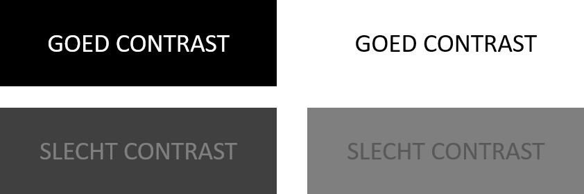

In een machinevisie applicatie is het tevens belangrijk dat het object makkelijk kan worden onderscheidt van de achtergrond (dit is eigenlijk ruis).

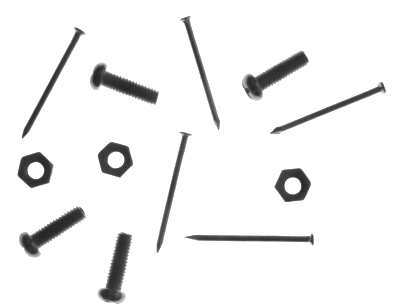

Zowel de lens, de sensor als verlichting spelen een belangrijke rol in het bepalen van het resulterende contrast.

Het vermogen om contrast te reproduceren wordt enerzijds bepaald door de kwaliteit van de lens en anderzijds door de resolutie van de camerasensor.

In realiteit is het onmogelijk om een perfecte overgang te maken van zwart naar wit aan de randen van een object. Dit ligt enerzijds aan de aard van licht en aan het feit dat een lens en sensor nooit perfect kunnen worden geproduceerd. De overgang zal steeds blurry zijn in het resulterende beeld. Echter zal een betere sensor en lens zorgen voor een scherpere overgang.

De mogelijkheid om scherpe overgangen te reproduceren bepaalt ook hoe goed een onderscheidt zal kunnen worden gemaakt tussen objecten die dichter bij elkaar komen te liggen. Onderstaand een voorbeeld van twee dots die eerst ver uit elkaar liggen en dan dichter bij elkaar worden geplaatst. In het eerste geval zijn ze nog goed van elkaar te onderscheiden. In het tweede geval lopen ze over in elkaar door het feit dat de randen blurry zijn.

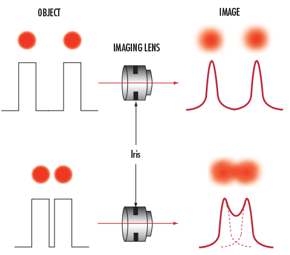

Dit wordt dikwijls getest aan de hand van een Ronchi patroon. Hierbij wordt een beeld genomen van witte en zwarte lijnen die op een bepaalde afstand van elkaar liggen. Dit wordt de frequentie genoemd van de lijnen. Daarom wordt het vermogen van een lens om contrast over te brengen ook gespecificeerd bij een bepaalde frequentie. Hieronder een voorbeeld.

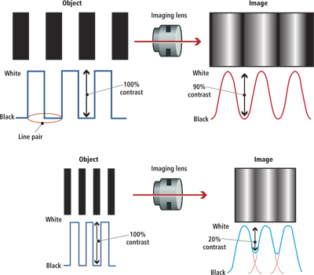

Onderstaande beelden zijn van eenzelfde object genomen, maar door twee verschillende lenzen met eenzelfde sensor en camera. Beide beelden werden uit het centerpunt van de sensor genomen. Het vermogen van elke lens om het contrast te reproduceren is een bepalende factor voor de prestaties van het systeem.

## Lichtbronnen

Er bestaan een overvloed aan lichtbronnen, van gloeilampen tot TL-buizen en van LED-verlichting tot laser-diodes.

De dag van vandaag is LED-verlichting een van de meest gebruikte lichtbronnen bij machinevisie. Lasers en patroonprojectoren worden meestal gebruikt voor 3D applicaties.

Bij de selectie van de meest geschikte lichtbron moet rekening worden gehouden met een aantal factoren, waaronder:

* **het lichtspectrum**: let erop dat de lichtbron de juiste kleur van licht uitstraalt. Sommige verlichting straalt een heel brede band van het spectrum uit.
* **het rendement**: hoeveel energie er verloren gaat als warmte bij een bepaalde lichtintensiteit
* **de levensduur**: hoe lang gaat een bepaalde lichtbron mee ? Dit heeft meestal ook een invloed op de intensiteit van de lichtbron en soms zelfs ook op de uitgestraalde golflengten.
* **de lichtintensiteit**: hoe helder is het licht en is dit genoeg voor de applicatie.
* **de afmetingen**: past deze in beschikbare ruimte
* **de warmteontwikkeling**: welke eisen gelden voor de warmteafvoer
* ...

## Golflengtes en kleuren

Initieel wordt meestal vertrokken van wit licht. Dit is een verzameling van golflengtes van ongeveer 350nm tot 700nm zoals te zien in onderstaande figuur.

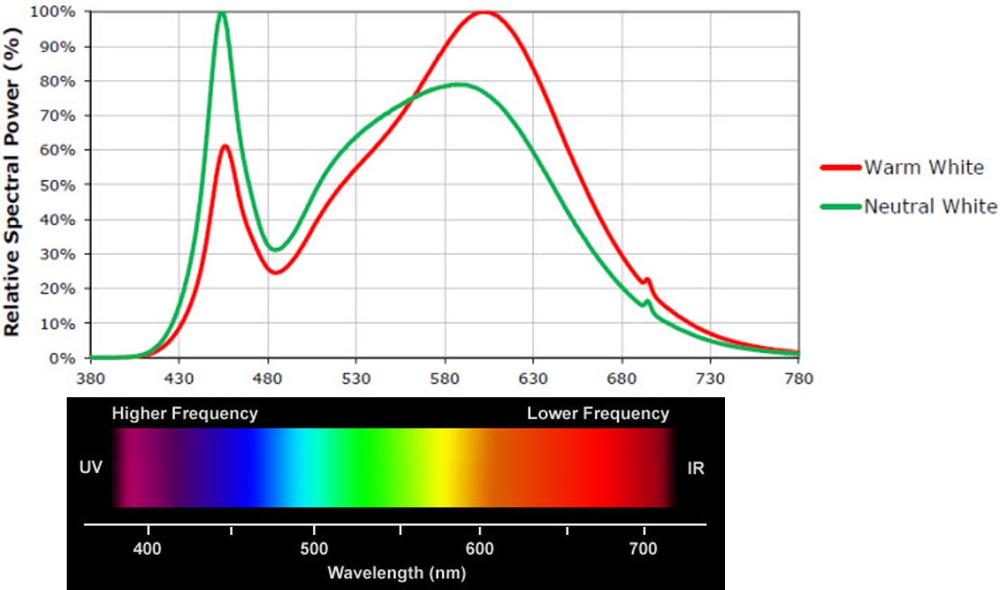

Het is echter aangewezen om met één bepaalde kleur te werken. Onder andere om de chromatische aberratie te verkleinen. Daarnaast versterkt het belichten van een gekleurd object met de tegenovergestelde kleur het contrast van dit object in een monochroom beeld.

Algemeen geweten is dat een rood object er rood uitziet omdat wanneer het wordt belicht het alle golflengtes van dat licht absorbeert behalve deze die overeenstemmen met het kleur van het object zelf. De golflengtes die niet worden geabsorbeerd worden gereflecteerd en kunnen dus worden opgevangen door het menselijk oog of een camera. Onderstaande afbeelding geeft het principe hiervan weer.

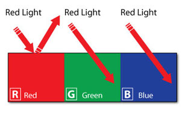

Dit betekent dus als je een rood object lichter in beeld wilt brengen, je dit kan verwezelijken door gebruik te maken van rood licht. Dus door met eenzelfde kleur te belichten wordt de intensiteit van het object versterkt.

Het omgekeerde is ook mogelijk. Zo kan je een rood object laten verdonkeren door het te belichten met bijvoorbeeld een blauw licht.

Daarnaast kan je ook een filter op de lens plaatsen om dit effect nog te versterken door enkel bepaalde kleuren door te laten.

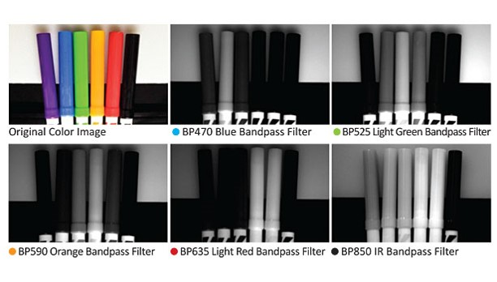

Belichten met IR (InfraRed), beter gezegd NIR (Near InfraRed), werkt net zoals belichten met licht in het visuele deel van het spectrum. Men heeft een lichtbron, een object en een ontvanger (sensor). Het effect dat speelt op het object is steeds een som van transmissie, reflectie of absorptie. Het is zo dat voor een gegeven materiaal deze verhoudingen anders liggen bij andere golflengtes. Zo worden de invloeden van kleuren weggewerkt en is het de materiaalsoort die primeert.

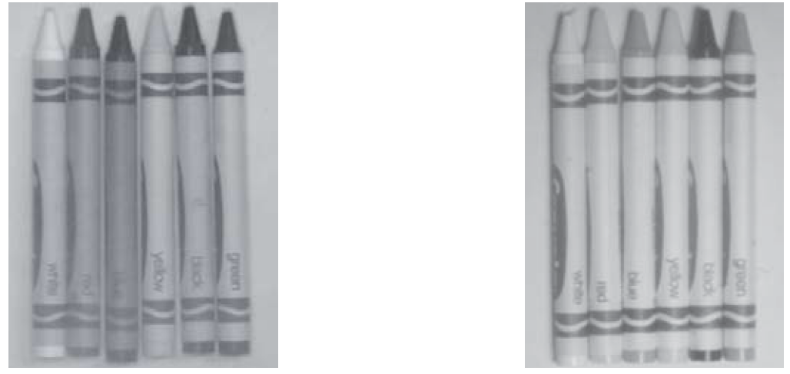

In geval er gebruik wordt gemaakt van een kleurencamera is het belangrijk dat belichting in dit geval gebalanceerd is en alle kleuren bevat. Anders ziet de camera verschillende intensiteiten voor verschillende kleuren. Veel kleurencamera's echter wel correcties uitvoeren.

## LED-verlichting

De meeste gebruikte verlichting voor machinevisie is op dit moment LED-verlichting.

Verlichting op basis van LED's brengt heel wat voordelen met zich mee:

* **Levensduur**: LED's kunnen tot 100'000 uur meegaan.
* **Kostprijs**: vergeleken met andere verlichting zijn LED's vrij goedkoop.
* **Kleuren**: ondertussen zijn LED's in vele kleuren beschikbaar.
* **Strobing**: LED's kunnen makkelijk worden gestrobed om zo ook hun levensduur te verlengen.
* **Overdrive**: LED's zijn stroom gestuurd en kunnen ook voor korte tijd worden overstuurd om extra licht te genereren.
* ...

Een nadeel is wel dat de kleur van een LED kan verschillen tussen verschillende fabrikanten en dit geldt extra voor witte LED's. Dit kan een probleem zijn wanneer de LED-verlichting van een bestaand systeem moet worden vervangen.

Rode LED's worden het meest gebruikt omdat CCD sensoren voor deze golflengte ook het meest gevoelig zijn.

## Belichtingsprincipes

Er zijn een aantal belangrijke belichtingsprincipes die elk in een bepaalde situatie toepasbaar zijn. Deze belichtingsprincipes kunnen dikwijls op verschillende manieren worden verwezenlijkt met verschillende types lichtbronnen, maar hier gaan we vooral uit van LED-verlichting.

### Een backlight

Een backlight is een uniforme vlakke belichting die achter het te inspecteren object wordt geplaatst. Het object kan transparant zijn als men zaken in het materiaal of de interne componenten wil controleren.

Indien het object niet transparant is zal enkel de contour inspecteerbaar zijn. Dit doordat het object geen licht doorlaat en dus zwart zal zijn op het resulterende beeld. De achtergrond zal dan een hoge intensiteit hebben en dus een groot contrast veroorzaken met het object.

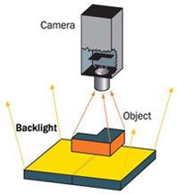

Onderstaand beeld toont een voorbeeld van een gloeilamp die werd belicht met verlichting langs boven (link) en verlichting aan de hand van een backlight (rechts). Rechts kunnen we heel duidelijk de contouren zien van de interne componenten.

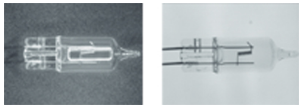

### Een ring light

Bij een ring light worden de LED's in een ringvormig omhulsel geplaatst. Hierbij kan de camera boven de ring light worden geplaatst en door het center van de ring het object waarnemen. De oriëntatie van de LED's hangt af van het belichtingsprincipe dat wordt toegepast (zie verder).

Een ring light zorgt ervoor dat er voor dat het object van alle kanten een gelijke verlichting ontvangt. Dit heeft tot effect dat schaduwvorming wordt geminimaliseerd.

Ring lights komen ook typische in twee configuraties, namelijk een als bright field belichting en als dark field belichting.

#### Bright field belichting

Bij dit type belichting wordt het licht door het object weerkaatst richting de lens. Deze veel gebruikte techniek is toepasbaar voor het belichten van niet-spiegelende voorwerpen. Een spiegelend object zal anders de camera en/of verlichting tonen.

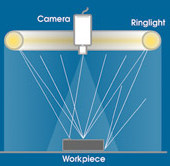

Onderstaand voorbeeld geeft een geponste QR-code terug die met bright field verlichting werd belicht. Er is duidelijk te zien dat oneffenheden in het oppervlak geen licht in de lens reflecteren en dus donker overkomen.

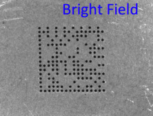

#### Dark field belichting

Hier wordt het licht niet weerkaatst richting lens. De camera ziet enkel verspreid licht ten gevolge van oneffenheden in oppervlak van het object. Met andere woorden, reliëf wordt hierdoor zichtbaar.

Dit kan worden verwezenlijkt door een ring light zeer dicht bij het object te plaatsen.

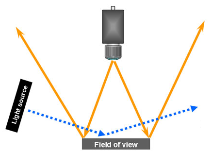

Onderstaand voorbeeld geeft een geponste QR-code terug die met dark field verlichting werd belicht. Er is duidelijk te zien dat oneffenheden in het oppervlak nu wel licht in de lens reflecteren en dus licht overkomen.

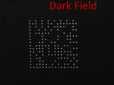

Dit type belichting wordt veel gebruikt om krassen en scheuren in oppervlakten waar te nemen.

#### Voorbeelden van bright field en dark field belichting

### Bar light

Bar lights genereren een intense en uniform lijn licht. Deze worden typisch toegepast in combinatie met een line-scan camera.

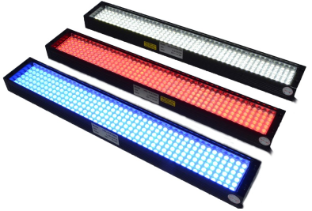

### Dome light

Dome lights zorgen voor een even en homogene verlichting van het object. Ze zijn gelijkaardig aan een bright field ring light, met het verschil dat ze tevens reflecterende oppervlakten kunnen verlichten zonder nadelige effecten.

Onderstaande figuur toont het principe van een dome light.

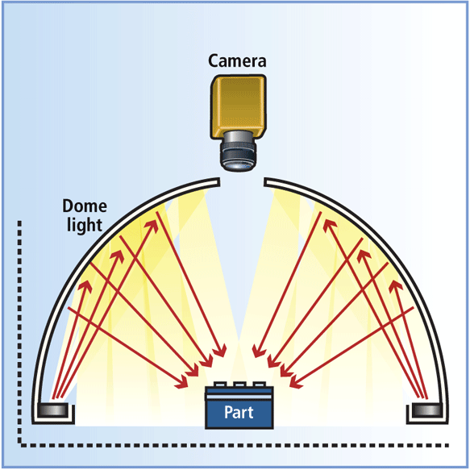

Volgend voorbeeld toont een folie die bedrukt is met een vervaldatum. In eerste instantie werd deze verlicht met een bright field ring light (rechts). Door de vele reflecties is het beeld niet bruikbaar. Door hier gebruik te maken van een dome light worden de reflecties geneutraliseerd (links).

## Belichtingsmode

Voor het belichten van het object kan men er worden gekozen tussen continue, pulserende of strobe verlichting.

* **Continue verlichting**: de verlichting brandt continu. Nadeel is dat de belichting sneller zal verzwakken en vroeger aan het einde van de levensduur zal komen.

* **Pulserende verlichting**: wordt gebruikt als er pauzes zijn tussen het zich presenteren van een object. Hierdoor wordt de tijd dat de verlichting verzwakt vertraagd en de levensduur verlengd. Dit is bijvoorbeeld toepasbaar wanneer de objecten op een vaste tijdspannen worden aangevoerd via een transportband.

* **Strobe verlichting**: wordt gebruikt om bewegingsonscherpte te voorkomen, analoog met de belichtingstijd.

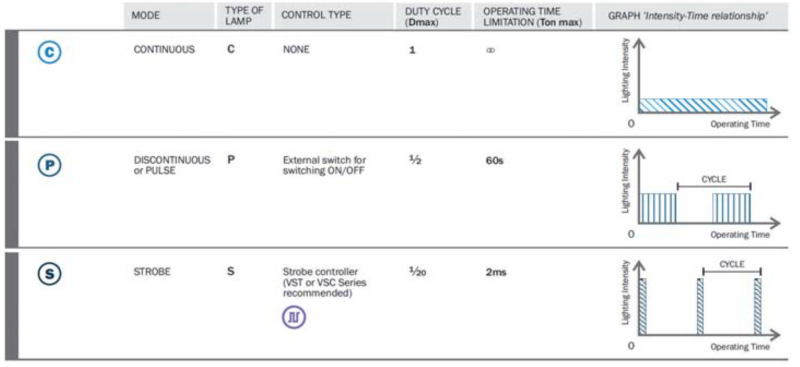

## Polariserende filters

Bij glimmende of spiegelende objecten treedt dikwijls een saturatie op van de pixels. Dit doordat de lichtintensiteit die de pixels bereiken te groot is in vergelijking met omliggende pixels, waar wel nuttige informatie te vinden is.

In bepaalde gevallen kan het volstaan om een polarisatiefilter op de lens te plaatsen, maar in veel gevallen zal ook het licht van de belichting moeten worden gepolariseerd. Dit is zeker het geval indien de hinderlijke reflectie afkomstig is van glas of transparante verpakkingsfolie.

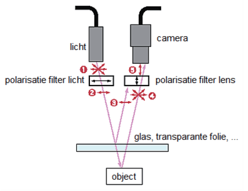
